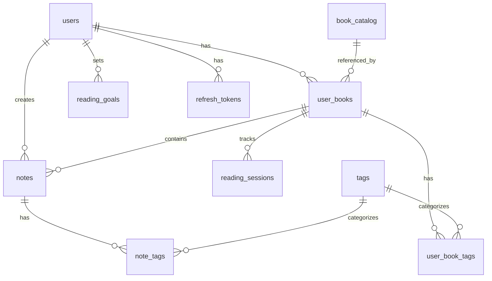

# 📚 Memory - Sistema de Gestión de Lecturas

## 📋 Descripción General

Memory es una aplicación web para gestionar tu biblioteca personal, realizar seguimiento de tus lecturas y, lo más importante, capturar notas y aprendizajes de cada libro que lees. Permite mantener múltiples notas por libro, organizarlas, etiquetarlas y hacer búsquedas inteligentes.

## 🏗️ Arquitectura de Base de Datos

### Diagrama de Relaciones



## 📊 Estructura de Tablas

### 1. **users** - Usuarios del Sistema
Almacena la información de autenticación y perfil de cada usuario.

| Campo | Tipo | Descripción |
|-------|------|-------------|
| `id` | UUID PK | Identificador único |
| `email` | VARCHAR UNIQUE | Email del usuario |
| `username` | VARCHAR UNIQUE | Nombre de usuario único |
| `password_hash` | VARCHAR | Contraseña encriptada |
| `full_name` | VARCHAR | Nombre completo |
| `avatar_url` | VARCHAR | URL de la imagen de perfil |
| `email_verified` | BOOLEAN | Estado de verificación del email |
| `is_active` | BOOLEAN | Si la cuenta está activa |
| `created_at` | TIMESTAMP | Fecha de registro |
| `updated_at` | TIMESTAMP | Última actualización |

### 2. **book_catalog** - Catálogo Maestro de Libros
Información objetiva y compartida de los libros. Un mismo libro puede estar en las bibliotecas de múltiples usuarios.

| Campo | Tipo | Descripción |
|-------|------|-------------|
| `id` | UUID PK | Identificador único |
| `isbn` | VARCHAR UNIQUE | ISBN del libro |
| `title` | VARCHAR | Título del libro |
| `original_title` | VARCHAR | Título original (si es traducción) |
| `author` | VARCHAR | Autor principal |
| `co_authors` | VARCHAR[] | Co-autores |
| `cover_url` | VARCHAR | URL de la portada |
| `pages` | INTEGER | Número de páginas |
| `publisher` | VARCHAR | Editorial |
| `publication_year` | INTEGER | Año de publicación |
| `language` | VARCHAR(2) | Código de idioma (es, en, fr) |
| `description` | TEXT | Sinopsis del libro |
| `google_books_id` | VARCHAR | ID en Google Books API |
| `open_library_id` | VARCHAR | ID en Open Library |
| `created_at` | TIMESTAMP | Fecha de creación |

### 3. **user_books** - Biblioteca Personal
La experiencia personal de cada usuario con un libro específico.

| Campo | Tipo | Descripción |
|-------|------|-------------|
| `id` | UUID PK | Identificador único |
| `user_id` | UUID FK | Referencia al usuario |
| `book_catalog_id` | UUID FK | Referencia al libro |
| `personal_rating` | DECIMAL(2,1) | Rating personal (0.5 a 5.0) |
| `status` | ENUM | Estado de lectura |
| `start_date` | DATE | Fecha de inicio |
| `finish_date` | DATE | Fecha de finalización |
| `read_count` | INTEGER | Veces leído |
| `is_favorite` | BOOLEAN | Marcado como favorito |
| `is_owned` | BOOLEAN | Si posee el libro físicamente |
| `format` | ENUM | Formato (físico/ebook/audiobook) |
| `current_page` | INTEGER | Página actual |
| `progress_percentage` | DECIMAL(5,2) | Porcentaje de progreso |
| `created_at` | TIMESTAMP | Fecha de agregado |
| `updated_at` | TIMESTAMP | Última actualización |

**Estados posibles (status)**:
- `want_to_read` - Por leer
- `reading` - Leyendo actualmente
- `completed` - Completado
- `abandoned` - Abandonado
- `on_hold` - En pausa

### 4. **notes** - Notas y Aprendizajes
El núcleo de la aplicación: las notas, reflexiones y aprendizajes sobre cada libro.

| Campo | Tipo | Descripción |
|-------|------|-------------|
| `id` | UUID PK | Identificador único |
| `user_book_id` | UUID FK | Referencia al libro del usuario |
| `user_id` | UUID FK | Referencia al usuario (redundante para queries) |
| `title` | VARCHAR | Título de la nota (opcional) |
| `content` | TEXT | Contenido de la nota |
| `type` | ENUM | Tipo de nota |
| `page_number` | INTEGER | Número de página relacionada |
| `chapter` | VARCHAR | Capítulo relacionado |
| `context` | VARCHAR | Contexto adicional |
| `is_public` | BOOLEAN | Si la nota es pública |
| `is_favorite` | BOOLEAN | Marcada como favorita |
| `color` | VARCHAR(7) | Color de highlight (#FF5733) |
| `created_at` | TIMESTAMP | Fecha de creación |
| `updated_at` | TIMESTAMP | Última actualización |

**Tipos de notas (type)**:
- `quote` - Cita textual del libro
- `thought` - Reflexión personal
- `summary` - Resumen de capítulo/sección
- `learning` - Aprendizaje clave
- `review` - Reseña general

### 5. **tags** - Sistema de Etiquetas
Etiquetas reutilizables para categorizar tanto libros como notas.

| Campo | Tipo | Descripción |
|-------|------|-------------|
| `id` | UUID PK | Identificador único |
| `name` | VARCHAR UNIQUE | Nombre de la etiqueta |
| `slug` | VARCHAR UNIQUE | Slug para URLs |
| `color` | VARCHAR(7) | Color hexadecimal |
| `created_at` | TIMESTAMP | Fecha de creación |

### 6. **Tablas de Relación Many-to-Many**

#### **user_book_tags**
Relaciona libros del usuario con etiquetas.

| Campo | Tipo | Descripción |
|-------|------|-------------|
| `user_book_id` | UUID FK | Referencia al libro del usuario |
| `tag_id` | UUID FK | Referencia a la etiqueta |

#### **note_tags**
Relaciona notas individuales con etiquetas.

| Campo | Tipo | Descripción |
|-------|------|-------------|
| `note_id` | UUID FK | Referencia a la nota |
| `tag_id` | UUID FK | Referencia a la etiqueta |

### 7. **reading_sessions** - Sesiones de Lectura
Tracking detallado del progreso de lectura.

| Campo | Tipo | Descripción |
|-------|------|-------------|
| `id` | UUID PK | Identificador único |
| `user_book_id` | UUID FK | Referencia al libro del usuario |
| `start_page` | INTEGER | Página inicial |
| `end_page` | INTEGER | Página final |
| `pages_read` | INTEGER | Páginas leídas (calculado) |
| `duration_minutes` | INTEGER | Duración en minutos |
| `session_date` | DATE | Fecha de la sesión |
| `notes` | VARCHAR | Nota rápida de la sesión |
| `created_at` | TIMESTAMP | Fecha de creación |

### 8. **reading_goals** - Metas de Lectura
Objetivos anuales de lectura del usuario.

| Campo | Tipo | Descripción |
|-------|------|-------------|
| `id` | UUID PK | Identificador único |
| `user_id` | UUID FK | Referencia al usuario |
| `year` | INTEGER | Año de la meta |
| `books_target` | INTEGER | Meta de libros |
| `pages_target` | INTEGER | Meta de páginas |
| `books_completed` | INTEGER | Libros completados |
| `pages_completed` | INTEGER | Páginas completadas |
| `created_at` | TIMESTAMP | Fecha de creación |
| `updated_at` | TIMESTAMP | Última actualización |

### 9. **refresh_tokens** - Tokens de Refresco
Para mantener las sesiones de usuario activas de forma segura.

| Campo | Tipo | Descripción |
|-------|------|-------------|
| `id` | UUID PK | Identificador único |
| `user_id` | UUID FK | Referencia al usuario |
| `token` | VARCHAR UNIQUE | Token único |
| `expires_at` | TIMESTAMP | Fecha de expiración |
| `created_at` | TIMESTAMP | Fecha de creación |

## 🏷️ Sistema de Tags: Relación con Notas y Libros

### ¿Cómo funcionan los tags?

El sistema de tags es **dual** - pueden aplicarse tanto a libros como a notas individuales:

#### **Tags en Libros (user_book_tags)**
- Categorizan el libro completo en tu biblioteca
- Ejemplos: `filosofía`, `autoayuda`, `ficción`, `clásicos`, `prestado`, `regalo`
- Un libro puede tener múltiples tags
- Útil para: Filtrar tu biblioteca, estadísticas por categoría

#### **Tags en Notas (note_tags)**
- Categorizan notas específicas dentro de un libro
- Ejemplos: `importante`, `revisar`, `cita-favorita`, `para-blog`, `idea-proyecto`
- Una nota puede tener múltiples tags
- Útil para: Encontrar notas específicas across todos tus libros

### Casos de Uso de Tags

```sql
-- Ejemplo 1: Todas las notas marcadas como "importante" de todos mis libros
SELECT n.*, bc.title as book_title
FROM notes n
JOIN note_tags nt ON n.id = nt.note_id
JOIN tags t ON nt.tag_id = t.id
JOIN user_books ub ON n.user_book_id = ub.id
JOIN book_catalog bc ON ub.book_catalog_id = bc.id
WHERE t.slug = 'importante' AND n.user_id = :userId;

-- Ejemplo 2: Todos mis libros de filosofía
SELECT bc.*, ub.*
FROM user_books ub
JOIN book_catalog bc ON ub.book_catalog_id = bc.id
JOIN user_book_tags ubt ON ub.id = ubt.user_book_id
JOIN tags t ON ubt.tag_id = t.id
WHERE t.slug = 'filosofia' AND ub.user_id = :userId;

-- Ejemplo 3: Buscar notas con múltiples tags (importante Y para-blog)
SELECT DISTINCT n.*
FROM notes n
WHERE n.user_id = :userId
  AND EXISTS (
    SELECT 1 FROM note_tags nt
    JOIN tags t ON nt.tag_id = t.id
    WHERE nt.note_id = n.id AND t.slug = 'importante'
  )
  AND EXISTS (
    SELECT 1 FROM note_tags nt
    JOIN tags t ON nt.tag_id = t.id
    WHERE nt.note_id = n.id AND t.slug = 'para-blog'
  );
```

## 🔍 Índices para Optimización

```sql
-- Búsquedas frecuentes
CREATE INDEX idx_user_books_user_status ON user_books(user_id, status);
CREATE INDEX idx_notes_user_book ON notes(user_book_id);
CREATE INDEX idx_notes_type ON notes(type);
CREATE INDEX idx_book_catalog_isbn ON book_catalog(isbn);
CREATE INDEX idx_reading_sessions_date ON reading_sessions(user_book_id, session_date);

-- Full Text Search en PostgreSQL
CREATE INDEX idx_notes_search ON notes USING GIN(to_tsvector('spanish', content));
CREATE INDEX idx_books_search ON book_catalog USING GIN(to_tsvector('spanish', title || ' ' || author));
```

## 📈 Estadísticas Posibles

Con este modelo podemos obtener:

1. **Estadísticas de Lectura**
   - Libros leídos por año/mes
   - Páginas totales leídas
   - Tiempo promedio por libro
   - Géneros más leídos

2. **Análisis de Notas**
   - Promedio de notas por libro
   - Tipos de notas más frecuentes
   - Libros con más aprendizajes

3. **Hábitos de Lectura**
   - Días más activos
   - Rachas de lectura
   - Velocidad de lectura (páginas/día)

4. **Progreso de Metas**
   - % de meta anual completada
   - Proyección de cumplimiento
   - Comparación año a año

## 🚀 Fases de Implementación

### Fase 1: MVP (Semana 1-2)
- [ ] Sistema de autenticación (JWT)
- [ ] CRUD de libros personales
- [ ] CRUD de notas
- [ ] Vista básica libro + notas

### Fase 2: Enriquecimiento (Semana 3)
- [ ] Integración Google Books API
- [ ] Sistema de tags
- [ ] Búsqueda y filtros
- [ ] Rating con estrellas

### Fase 3: Tracking (Semana 4)
- [ ] Sesiones de lectura
- [ ] Estadísticas personales
- [ ] Metas anuales
- [ ] Dashboard con gráficos

### Fase 4: Social (Futuro)
- [ ] Notas públicas
- [ ] Compartir reseñas
- [ ] Seguir otros lectores
- [ ] Recomendaciones

## 🛠️ Stack Tecnológico

- **Backend**: NestJS + TypeScript
- **ORM**: TypeORM
- **Base de Datos**: PostgreSQL
- **Cache**: Redis
- **Frontend**: Vue 3 + TypeScript
- **UI**: TailwindCSS / PrimeVue
- **Auth**: JWT + Refresh Tokens
- **API Externa**: Google Books API

## 📝 Notas de Implementación

1. **UUIDs vs IDs autoincrementales**: Usamos UUIDs para mayor seguridad y facilitar sincronización futura
2. **Soft deletes**: Considerar agregar `deleted_at` a las tablas principales
3. **Auditoría**: Considerar tabla de audit_logs para cambios críticos
4. **Caché**: Redis para cachear book_catalog y búsquedas frecuentes
5. **Imágenes**: Considerar almacenamiento en S3/Cloudinary para portadas custom